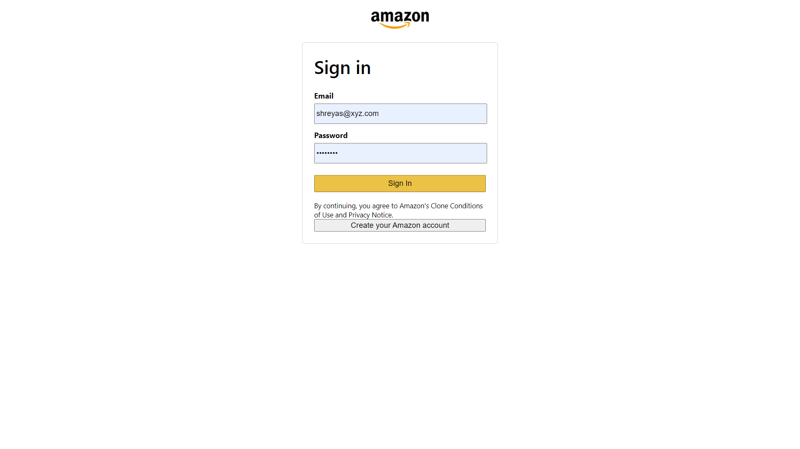

# This Project was meant for Practice Purpose

# https://challenge-3fa5b.web.app/ ###<<< hosted webapp

## It has Major Functionalities of Login, Signup, Place Order, Payment Gateway Through Stripe (Test), Order History For User.
#
## For Starting the project on localhost, first Login/Signup on Stripe use the Publishable Test Key from Api of Stripe and put it in App.js in SRC folder in Fucntions folder, Index.js> copy Secret key.
# 
#
# Before Procceding check that cors, firebase, stripe, express are installed in functions (backend) folder.
#
# In Terminal 1 >> go to the local project folder and run >>> **npm start**
# In Terminal 2 >> go to functions>>> **firebase emulators:start**
#
# YOU ARE READY TO GO! 🚀 🚀
# This project is completly based on TESTING purpose not for PRODUCTION.
#
#
#
# Screenshots

## 1.Home Page

## 2.Login Page

## 3.Basket

## 4.Checkout

## 5.Order History 

## 6.Firebase Order In FireStore

## 7.Stripe Prewiew

## 8. Stripe Success Payments

##!!! Payment Method will not work cause it required Blaze plan in firebase hosting !!!
